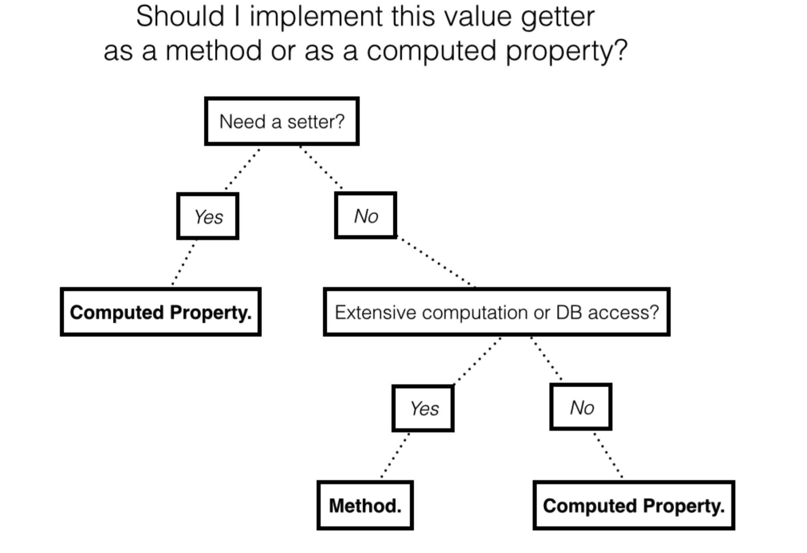

#swift 学习（7）Methods
>  Methods, as you’ve already seen, are merely functions that reside inside a structure.

**Comparing methods to computed properties**
使用计算属性还是使用方法，可以使用下面的逻辑进行判断。



### **mutating methods**
> Methods in structures cannot change the values of the instance without being marked as mutating. You can imagine a method in the Date structure that advances to the next day:

```
mutating func advance() {
    day += 1 
}
```

### **Type methods**


> Like type properties, you can use type methods to access data across all instances. You call type methods on the type itself, instead of on an instance. To define a type method, you prefix it with the static modifier.

```
struct Math {
  // 1
  static func factorial(of number: Int) -> Int {
    // 2
    return (1...number).reduce(1, *)
  }
}
```


### **extensions**


### **Key points**

* Methods are behaviors that extend the functionality of a type.
* A method is a function defined inside of a named type.
* A method can access the value of an instance by using the keyword self.
* Initializers are methods that aid in the creation of a new instance.


