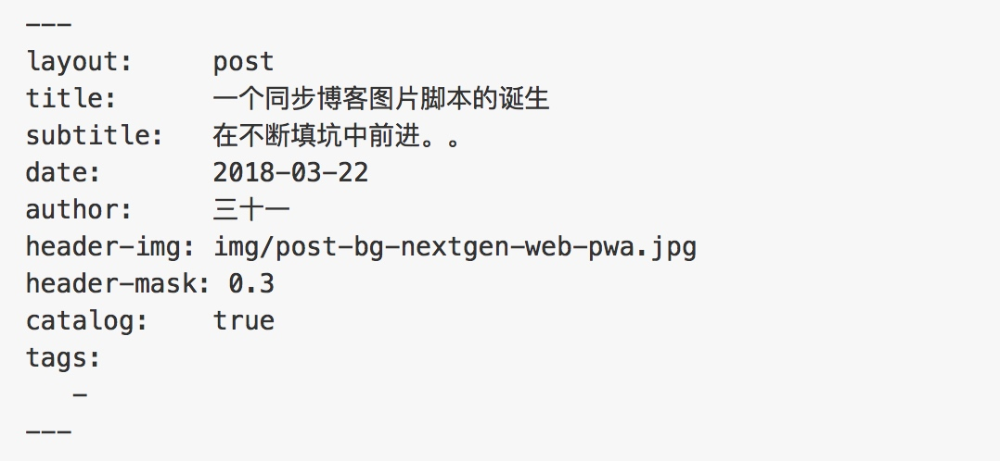

# 一个同步博客图片脚本的诞生

> 由于种种原因，我博客的图片和本地的 `MD` 使用的文件不在一个目录下，每次写完都需要同步图片到博客的目录下，手动操作很是繁琐，就写了一个脚本来做这个工作。


### 需求

同步博客使用的图片文件。

#### 思路：

1. 先根据上次同步的日期，找出最近修改了那些 `.md` 文件。
    * 获取上次同步的时间戳，获取 `.md` 文件修改的时间戳。
    * 比较时间戳，时间戳大于上次同步的时间戳，为满足条件的 `.md`文件。
2. 判断这些最近修改的 `.md` 文件，那些属于博客使用的文件。
    * 博客使用的 `.md` 文件会有特的开头，根据这个条件，过滤出博客文件。
    * 存储最大的时间戳。
3. 根据找到的 `.md` 文件，找到对应的本地图片文件夹。
    * 本地图片所在的路径是以本地  `.md`文件标题命名的，找打对应的图片文件夹。
4. 找到对应的图片文件夹后，同步文件到博客路径下。
    * 首先判断博客路径下该命名的的文件夹是否存在。
        1. 不存在 ：直接复制本地文件夹到博客路径。
        2. 存在 ：对比文件夹的内容。
            * 内容一致 ：不拷贝这个文件夹
            * 内容不一致 ：拷贝不一致的文件到博客路径下


blog 使用的文件头如下：



#### 具体代码实现：


```
# -*- coding: utf-8 -*-
import os
import sys
import time
import datetime
import shutil

date_info_path = "AAAA/docs/date.info"
MDFile_path = "AAAA/docs"
IMGFile_path = "AAAA/docs/media/"
IMGFile_BlogPath = "BBBB/media/"

# 获取上次同步的时间
def getLastModifTime():
    f = open(date_info_path, "r")
    content = f.read()
    f.close()
    return content.strip('\n')

#记录同步的时间 保存到本地
def changeLastModifTime(mtime):
    f = open(date_info_path, "w")
    f.write(str(mtime))
    f.close()

#判断文章是不是博客内容
def judgmentIsBlogFile(file):
    f = open(file, "r")
    content = f.readline().strip()
    f.close()
    if content == "---":
        return True
    else:
        return False

def removeDSFile(array):
    for item in array:
        if item.endswith(".DS_Store"):
            array.remove(item)


# 拷贝文件夹到博客目录
def copyLocalIMGDIRToBlogIMG(localIMG,blogIMG):
    shutil.copytree(localIMG, blogIMG)
    print("拷贝文件夹。。。。"+localIMG+blogIMG)


# 拷贝文件到博客目录
def copyLocalIMGToBlogIMG(localIMG,blogIMG):
    items = os.listdir(localIMG)
    for item in items:
        localItemPath = localIMG + "/" + item
        blogItemPath = blogIMG + "/" + item
        if os.path.exists(blogItemPath):
            # 判断是否修改
            # print
            print("blog目录文件存在" + str(item))

        else:
            # blog 不存在这种图片  直接拷贝
            print("blog目录文件不存在" + str(item))
            shutil.copyfile(localItemPath,blogItemPath)
            print("copy111 完成")
    print("拷贝单个文件。。。。"+localIMG+blogIMG)


def handleModifSource(fileArray):
    for item in fileArray:
        localPath = IMGFile_path + item
        blogPath = IMGFile_BlogPath + item
        if os.path.exists(localPath):
            t = get_FileModifyTime(localPath)
            if os.path.exists(blogPath):
                blogModifTime = get_FileModifyTime(blogPath)
                litems = os.listdir(localPath)
                bitems = os.listdir(blogPath)
                removeDSFile(litems)
                removeDSFile(bitems)
                if t > blogModifTime or litems != bitems:
                    # 拷贝图片
                    copyLocalIMGToBlogIMG(localPath,blogPath)
            else:
                # 存在本地图片 不存在博客图片 直接 拷贝
                copyLocalIMGDIRToBlogIMG(localPath,blogPath)


def getIMGChangeFileArray(file_dir):
    # 获取 MD 文件目录下的文件
    items = os.listdir(file_dir)
    # 获取上一次同步过后的时间戳
    lastModif = getLastModifTime()
    # 用于记录这次同步过后的时间戳
    nextModefiTime = lastModif
    changeFileDirArray = []
    for names in items:
        # 取出符合条件的MD文件
        if names.endswith(".md"):
            filePath2 = file_dir +"/"+ names
            # 判断是否是 博客用的文章
            if judgmentIsBlogFile(filePath2):
                time = get_FileModifyTime(filePath2)
                # 判断是否是已经通不过的文章
                if time > float(lastModif):
                    if float(nextModefiTime) < time:
                        # 记录最大修改时间，用于下次同步时的比较
                        nextModefiTime = str(time)
                    # 拼接获取最近修改的博客文章所用的图片路径
                    imgDIR = names[0:-3];
                    changeFileDirArray.append(imgDIR)
    changeLastModifTime(nextModefiTime)
    return changeFileDirArray

def get_FileModifyTime(filePath):
    t = os.path.getmtime(filePath)
    return t
    
def main():
    mArray = getIMGChangeFileArray(MDFile_path)
    handleModifSource(mArray)


# 执行
main()

```

#### 脚本执行
为了方便使用这个脚本，我们使用 `alias` 为这个脚本设置一个执行的别名。
打开 ` .zshrc`，添加：

```
alias BIMG='py /Users/Yunis/Desktop/SyncBlogPic/SyncBlogPic.py'
alias bimg='py /Users/Yunis/Desktop/SyncBlogPic/SyncBlogPic.py'
```

然后每次使用，就可以输入：`BIMG` 或者 `bimg` 就行了。


### 过程中的收获

很惭愧，这个小脚本，从昨天写到今天下午才算完成。编码速度太慢了，以后要经常锻炼这种自己的动手能力。

#### Shell
获取文件修改的时间信息

```
➜ stat -l -t '%F %T' 15216290581016.md
➜ -rw-r--r-- 1 Yunis staff 1641 2018-03-22 17:38:33 15216290581016.md

➜ stat -l -t '%F %T' 15216290581016.md | awk -F\   '{print $6" "$7}'
➜ 2018-03-22 17:38:33
```

* `stat ` 获取文件的信息
    *  `-l` : `Display output in ls -lT format.`
    * `-t` : `设置时间格式`
* `awk` :它允许您创建简短的程序，这些程序读取输入文件、为数据排序、处理数据、对输入执行计算以及生成报表，还有无数其他的功能。
    * `-F\ `  : 根据空格进行分割，`\`后面是有一个空格的。
    * `'{print $6" "$7}'` ：打印出第6个位置的值拼接上`" "`然后再拼接上第7个的值。


#### Python 

读取文件：

```
    f = open(date_info_path, "r")
    content = f.read()
    f.close()
```

逐行读取文件：

```
    f = open(file, "r")
    content = f.readline().strip()
    f.close()
```

写文件：

```
    f = open(date_info_path, "w")
    f.write(str(mtime))
    f.close()
```

copy 文件夹;

```
shutil.copytree(localIMG, blogIMG)
```
判断路径是否存在：

```
os.path.exists(blogItemPath)
```
获取路径下的文件列表：

```
os.listdir(localIMG)
```

copy 文件：

```
shutil.copyfile(localItemPath,blogItemPath)
```

获取文件的修改时间：

```
os.path.getmtime(filePath)
```

字符串是否已特定文件结尾：

```
names.endswith(".md")
```


